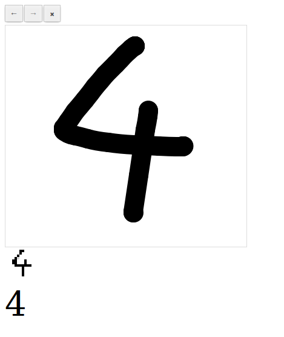

Number recognition neural network
=================================

Mount a neural network able to recognize hand-written numbers.




## Install

``` bash
make
make learn_init
```


## Usage

``` bash
# Train network on samples
make learn_train

# Test success rate on 1000 samples
make learn_test
```

Go to http://0.0.0.0:8580/lets-go/index.html to write a number
and let network recognize it in real-time.


## License

This library is under [MIT License](LICENSE).
